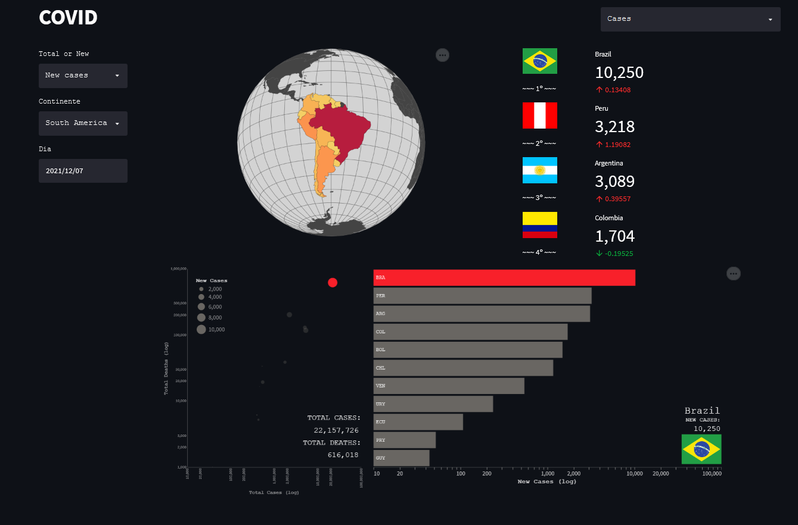
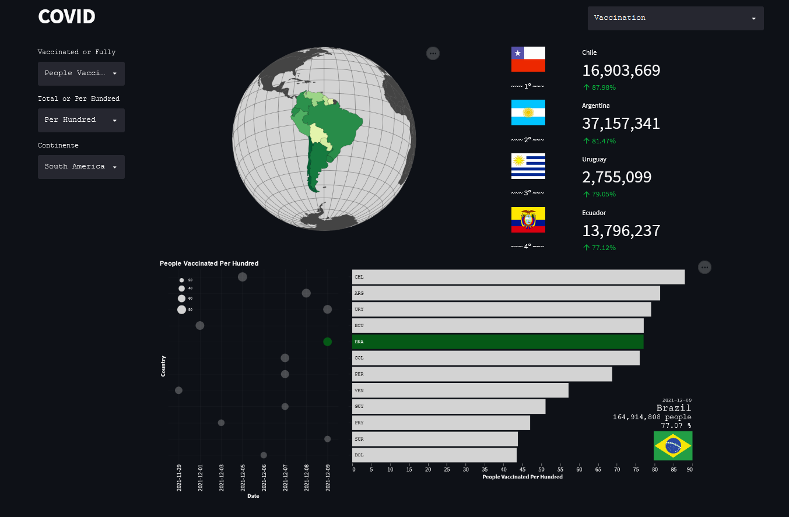
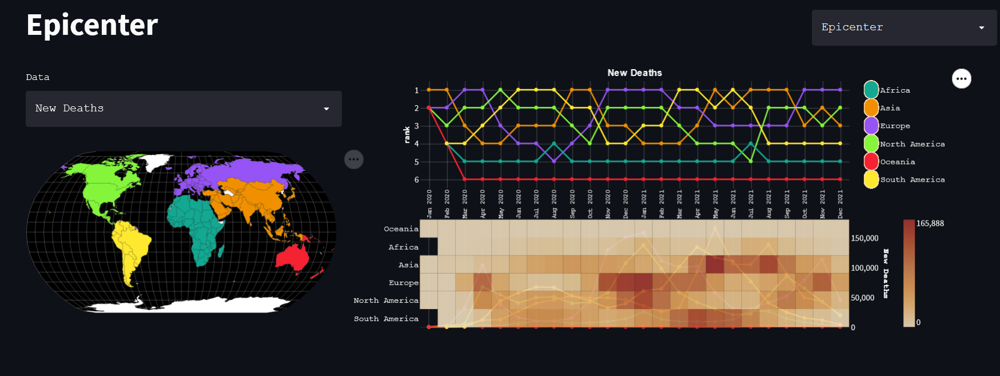
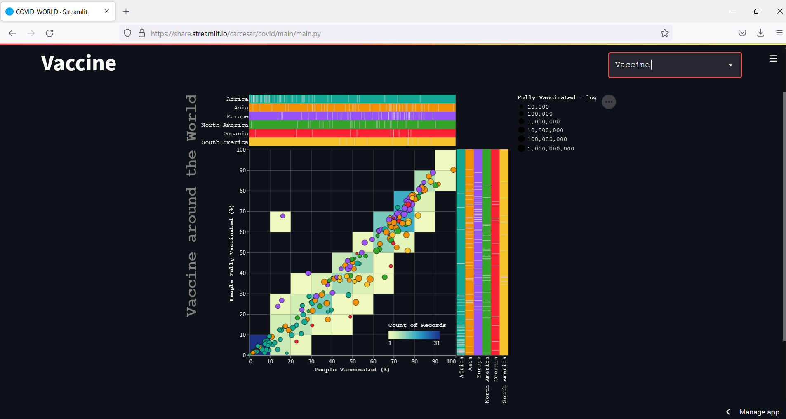

<h2>O trabalho</h2>

Este é meu trabalho  de Visualização da Informação do Mestrado em Modelagem Matematica da EMAP - FGV, com a professora Asla. 

 >  📝  [GitHub](https://github.com/CarCesar/COVID)  
 > 👁‍🗨 [Aplicação](https://share.streamlit.io/carcesar/covid/main/main.py)

<h2>A ideia</h2>

Minha ideia a principio foi pegar dados que tivessem dados temporais e espaciais pois eu queria muito utilizar mapa. Portanto, depois de algumas pesquisas resolvi pegar os dados de COVID pelo mundo.
    

    
<h2 style='font-family: "Courier", Courier, monospace;'>Execução</h2>
<h3 style='font-family: "Courier", Courier, monospace;'>Info</h3>

Para começar, peguei os dados de casos, fiz os seletores de 'New Cases' ou 'Total Cases',  de Continente e de Data. Em seguida fiz um mapa onde representei os dados no espaço, do lado coloquei uma lista dos paises que tinham mais incidentes entre os dados selecionados. Quando selecionado 'New Cases', o número grande indica os novos casos naquele dia, e o numerozinho representa a taxa de crescimento, quando selecionado 'Total Cases', o número grande indica o total de casos registrados até aquele dia e número pequeno os novos casos daquele dia.
    Em seguida fiz um scater plot em que o x é o Total de Casos (log) e o y é o Total de Mortes (log), em ambos os casos preferi a escala log. O tamanho dos circulos representa a quantidade de Novos ou Total de Casos a depender de qual foi escolhido, do lado e interligado está um bar plot em no y estão os paises, enquanto no x está Total ou Novos Casos a depender da escolha, porém aqui, os dados estão em escala log. Ao escolher uma barra ou um círculo, os dados relacionados irão acender e definir varias informações.
    Todo o processo feito aqui foi repetido para Mortes com algumas edições nas cores.
    

	 

    A ideia para Vacinação era fazer a mesma coisa que fiz para casos e para mortes, porém ao analisar os dados vi que não eram todos os dias que eram lançados os dados de todos os paises. Daria para fazer, mas eu teria que manipular os dados e não seria o trabalho mais facil do mundo. Além disso, toda a população de todo pais é para ser vacinada, além disso, totalmente vacinada. Então peguei os últimos dados lançados de cada país e fiz um mapa e uma lista muito parecidos com os anteriores, na lista aparecia os números de vacinados e a porcentagem da população que já se imunizou.
    Na hora de fazer os scater plot coloquei no eixo x a data do ultimo lançamento e no y os paises, o tamanho dos circulos é a quantia selecionada que também está representada no eixo x no gráfico de barras (se escolheu ver a quantia Total ele estará em log), no eixo y do grafico de barras estão os paises. Novamente, se selecionar um circulo ou uma barra, dados do pais selecionado irão aparecer pela tela.
   

	 

    Após ter feito isso, achei que estava faltando algo mais relacionado com os dados temporais...
   

   
   <h3 style='font-family: "Courier", Courier, monospace;'>Epicentro</h3>
   

    Meio na dúvida do que fazer, pensei que seria legal algum grafico que permitisse uma analise temporal, nesse caso o melhor contexto que achei, além de ser um assunto bem amplo, é 'Qual o epicentro da pandemia?', sabemos que esse epicentro é fluido, hoje é um lugar, amanhã pode ser outro totalmente diferente, então tentei resolver esse problema com a visualização. 'Para começar, me perguntei como vou definir que o continente epicentro da pandemia?' 
   

   
   <em style='font-family:"Courier", monospace;'>
    Seria o continente que tem mais casos em tal periodo de tempo?
   </em>
    
    
   <em style='font-family:"Courier", monospace;'>
     Ou será o continente que tem mais mortes em tal periodo?
   </em>
    
    
   <em style='font-family:"Courier", monospace;'>
    Será que é certo perguntar pelo "mais", ou seria melhor perguntar pelo que tem mais incidencias dadas as populações?
   </em>
    
    
   

    É... Achei todos os contextos válidos. Então resolvi fazer um seletor onde o usuário pode selecionar. Falando da visualização propriamente dita, fiz um 'Bump Chart' e abaixo dele um 'Heatmap' com uma legenda que permite a seleção de um continente ao lado, eu queria utilizar o mapa como a legenda ligada que seleciona os continentes, porém após alguma pesquisa vi que ainda não é possivel, porém coloquei o mapa ao lado para dar um charme e ser uma legenda auxiliar.
    Ao selecionar um continente, as linhas dos outros continentes ficam mais claras evidenciando o continente escolhido, no heatmap os outros continentes somem e o grafico de barras que está no fundo fca mais visivel (Não sei se sobrecarrega a visualização, porém achei legal as cores em um primeiro plano e as linhas evidenciando as quantidades indicadas pelas cores no heatmap). A visualização foi essa:
   

	 

   <h3 style='font-family: "Courier", Courier, monospace;'>Vacinas</h3>
   

    É muitas vezes ao vermos as notícias, tem algo relacionado com a OMS pedindo que os paises ricos tambem se solidarizem com os países mais pobres, principalmente os africanos. Então resolvi fazer essa visualização para ver como estão os paises de cada continente na vacinação. Para tal, fiz um heatmap com sobreposição de um scater plot. Para finalizar coloquei as legendas aos lados e uma marquinha para cada pais na região do seu continente. Coloquei a interatividade ao clicar nas legendas do mapa.
   

   

	 

   <h3 style='font-family: "Courier", Courier, monospace;'>Bibliografia</h3>
   

    Para fazer esse trabalho eu utilizei as bibliotecas Streamlit e Altair de Python. E consegui os dados utilizados nesse trabalho em:
   

   <a style='font-family:"Courier", monospace;' href='https://covid.ourworldindata.org/data/owid-covid-data.csv'>
    Our World in Data
   </a>
    
   <a style='font-family:"Courier", monospace;' href='https://github.com/stefangabos/world_countries/blob/master/data/en/countries.csv'>
    ISO CODE
   </a>
    
   <a style='font-family:"Courier", monospace;' href='https://github.com/csmoore/country-flag-icons/'>
    Bandeiras
   </a>
 
   
   

 
 
 

    
<table>
<tr>
<td>

### Quem Fez?
Carlos César Fonseca é estudante do 4º periodo(2021-2) de Ciência de Dados da Emap - FGV.
  
As vezes perdido, as vezes insano, mas no fundo com todo mundo é assim...
  
A pessoa da foto...

</td>
<td>

</td>
</tr>
</table>
